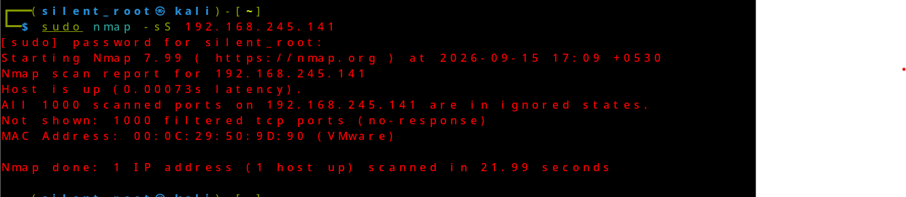
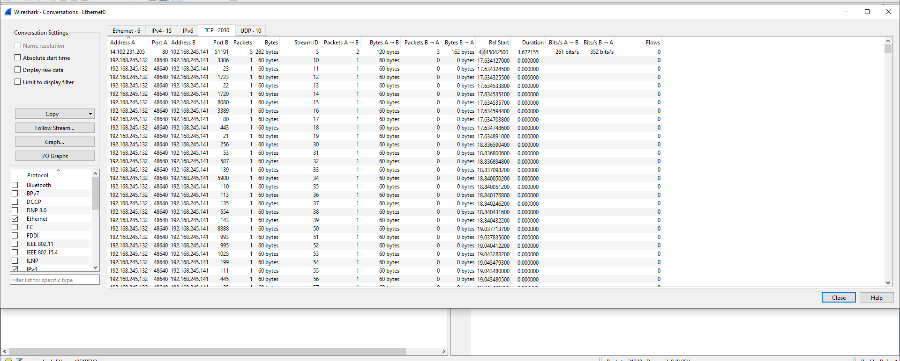
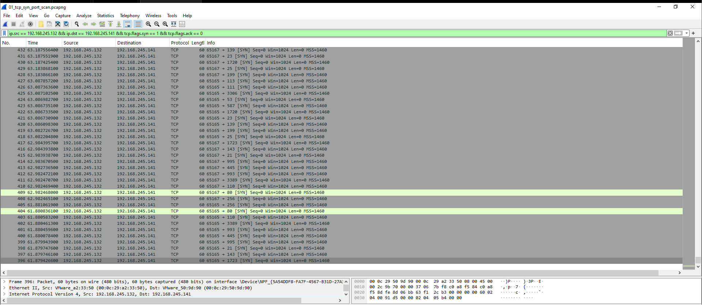

# TCP SYN Port Scan Detection

## Objective

Detect and analyze TCP SYN-based port scanning activity using Wireshark.

## Lab Setup

- Attacker: Kali Linux
- Attacker IP: 192.168.245.132
- Target: Windows 10
- Target IP: 192.168.245.141
- Tool used for attack: Nmap
- Tool used for packet analysis: Wireshark

## Attack Performed

A TCP SYN scan was performed from the Kali Linux machine against the Windows 10 machine using Nmap.

Command:

sudo nmap -sS 192.168.245.141

## Wireshark Observation

Wireshark captured multiple TCP SYN packets from the Kali Linux IP
192.168.245.132 to the Windows 10 IP 192.168.245.141.

The packets targeted multiple destination ports such as:

- 3306
- 23
- 1723
- 1720
- 8080
- 3389
- 80
- 443

## Detection

The traffic pattern indicates TCP SYN-based port scanning because the same source host repeatedly sent SYN packets to multiple destination ports on the same target host.

## Wireshark Filter

tcp.flags.syn == 1 && tcp.flags.ack == 0

## Conclusion

The captured traffic is consistent with TCP SYN port scanning activity.

## Evidence

### 1. Nmap Scan Result

### 2. Wireshark TCP Conversations

### 3. Wireshark SYN Packets

