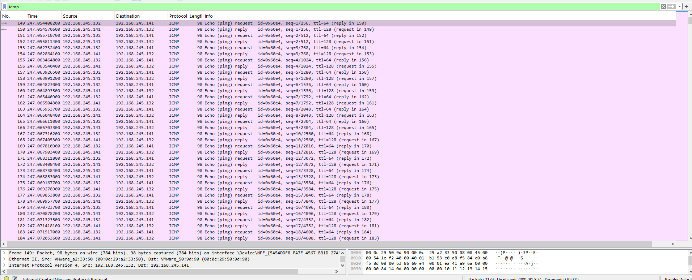
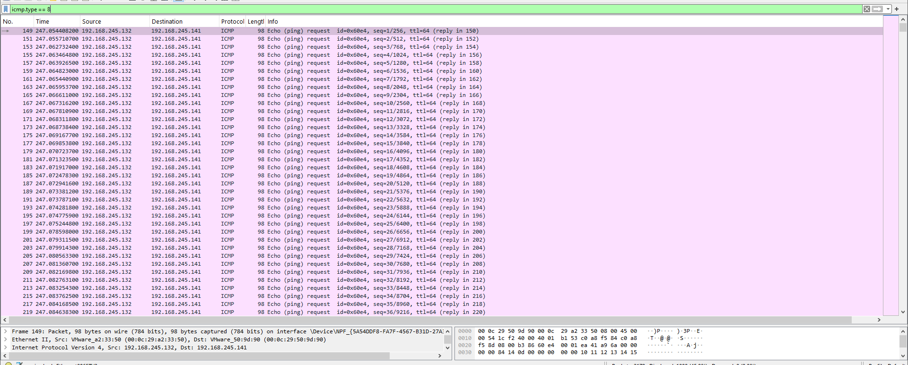

# ICMP Flood Detection

## Objective

Detect and analyze ICMP flood traffic using Wireshark.

## Lab Setup

- Attacker: Kali Linux
- Attacker IP: 192.168.245.132
- Target: Windows 10
- Target IP: 192.168.245.141
- Tool used for attack: ping
- Tool used for packet analysis: Wireshark

## Attack Performed

An ICMP flood was generated from the Kali Linux machine against the Windows 10 machine.

Command:

sudo ping -f -c 1000 192.168.245.141

The flood generated a large number of ICMP Echo Request packets in a short period of time.

## Wireshark Observation

Wireshark captured a high volume of ICMP Echo Request and Echo Reply packets between:

192.168.245.132 → 192.168.245.141

The traffic consisted of repeated ICMP Echo Requests generated at a very high rate.

## Detection

The traffic pattern is consistent with an ICMP flood because a large number of ICMP Echo Request packets were sent rapidly from a single source to the target.

## Wireshark Filters

Display all ICMP traffic:

icmp

Display only ICMP Echo Requests:

icmp.type == 8

## Conclusion

The captured traffic demonstrates an ICMP flood against the Windows 10 target. Wireshark was used to identify the large volume of ICMP Echo Request packets and analyze the traffic pattern.

## Evidence

### 1. ICMP Flood Packets

### 2. ICMP Echo Requests

