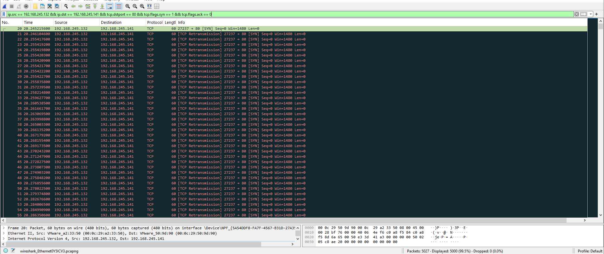

# TCP SYN Flood Detection

## Objective

Detect and analyze TCP SYN flood traffic using Wireshark.

## Lab Setup

- Attacker: Kali Linux
- Attacker IP: 192.168.245.132
- Target: Windows 10
- Target IP: 192.168.245.141
- Tool used for attack: Nping
- Tool used for packet analysis: Wireshark

## Attack Performed

A TCP SYN flood was generated from the Kali Linux machine against the Windows 10 machine.

Command:

sudo nping --tcp -p 80 --flags syn --rate 1000 -c 5000 192.168.245.141

The attack generated a large number of TCP SYN packets toward TCP port 80 in a short period of time.

## Wireshark Observation

Wireshark captured thousands of TCP SYN packets from:

192.168.245.132 → 192.168.245.141

The packets repeatedly targeted destination port 80.

Wireshark displayed approximately 5000 packets matching the SYN flood filter.

## Detection

The traffic pattern is consistent with a TCP SYN flood because a large number of SYN packets were sent rapidly from the same source to the same destination and destination port.

## Difference from SYN Port Scan

A SYN port scan sends SYN packets to multiple destination ports to discover available services.

A SYN flood sends a large number of SYN packets toward a target service, potentially exhausting resources by creating many incomplete TCP connection attempts.

## Wireshark Filter

ip.src == 192.168.245.132 && ip.dst == 192.168.245.141 && tcp.dstport == 80 && tcp.flags.syn == 1 && tcp.flags.ack == 0

## Conclusion

The captured traffic demonstrates TCP SYN flood activity against the Windows 10 target. Wireshark was used to identify the high volume of SYN packets and the repeated targeting of TCP port 80.

## Evidence

### TCP SYN Flood Packets

