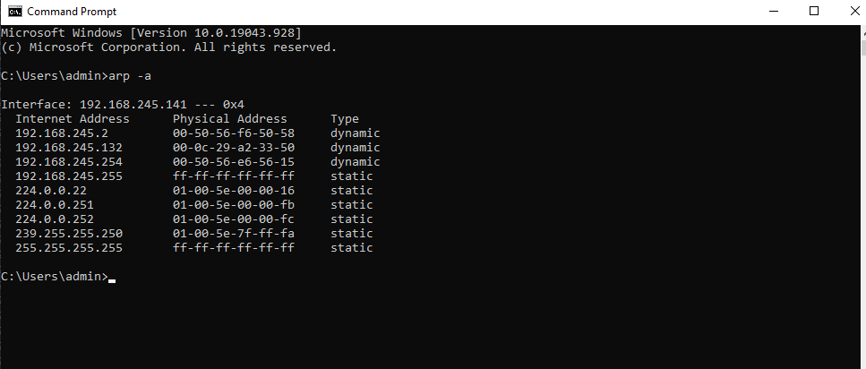
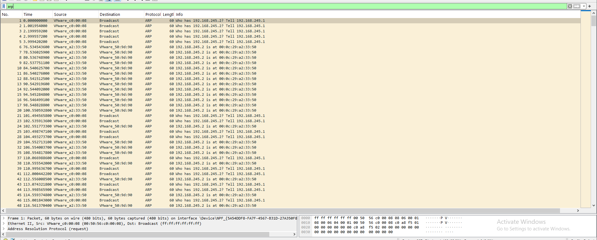

# ARP Spoofing Detection

## Objective

Detect and analyze ARP spoofing activity using Wireshark.

## Lab Setup

- Attacker: Kali Linux
- Attacker IP: 192.168.245.132
- Target: Windows 10
- Target IP: 192.168.245.141
- Gateway: 192.168.245.2
- Tool used for attack: arpspoof
- Tool used for packet analysis: Wireshark

## Attack Performed

ARP spoofing traffic was generated from the Kali Linux machine against the Windows 10 target.

Commands:

sudo arpspoof -i eth0 -t 192.168.245.141 192.168.245.2

sudo arpspoof -i eth0 -t 192.168.245.2 192.168.245.141

## Wireshark Observation

Wireshark captured repeated unsolicited ARP replies.

The following suspicious mapping was observed repeatedly:

192.168.245.2 is-at 00:0c:29:a2:33:50

The MAC address 00:0c:29:a2:33:50 belongs to the Kali machine.

This indicates that Kali was repeatedly advertising itself as the gateway.

## Detection

The repeated ARP replies claiming that the gateway IP address belongs to the attacker's MAC address are consistent with an ARP spoofing attempt.

## Validation

Before the spoofing attempt, the Windows ARP table contained:

192.168.245.2 → 00-50-56-f6-50-58

After the spoofing traffic was generated, the Windows ARP table still showed:

192.168.245.2 → 00-50-56-f6-50-58

Therefore, the captured traffic demonstrates an ARP spoofing attempt, but the Windows ARP cache was not successfully changed.

## Wireshark Filter

arp

## Conclusion

Wireshark successfully identified repeated suspicious ARP replies associated with an ARP spoofing attempt. The target's ARP cache did not change, so the evidence is documented as an attempted spoofing attack rather than confirmed successful ARP poisoning.

## Evidence

### 1. ARP Table Before Spoofing

### 2. ARP Spoofing Packets

