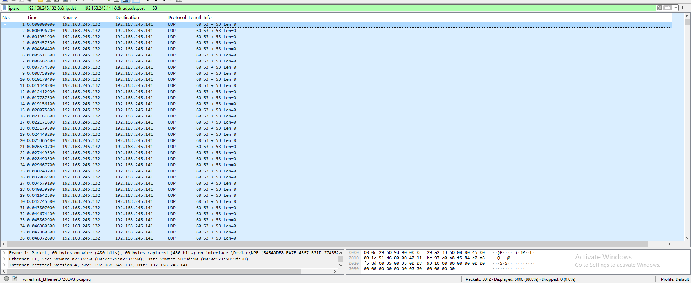

# UDP Flood Detection

## Objective

Detect and analyze UDP flood traffic using Wireshark.

## Lab Setup

- Attacker: Kali Linux
- Attacker IP: 192.168.245.132
- Target: Windows 10
- Target IP: 192.168.245.141
- Tool used for attack: Nping
- Tool used for packet analysis: Wireshark

## Attack Performed

A UDP flood was generated from the Kali Linux machine against the Windows 10 target.

Command:

sudo nping --udp -p 53 --rate 1000 -c 5000 192.168.245.141

The command generated 5000 UDP packets toward destination port 53 at a high packet rate.

## Wireshark Observation

Wireshark captured a large number of UDP packets from:

192.168.245.132 → 192.168.245.141

The packets repeatedly targeted UDP destination port 53.

After filtering the traffic, approximately 5000 packets were displayed.

## Detection

The traffic pattern is consistent with a UDP flood because a large volume of UDP packets was sent rapidly from a single source to the same target and destination port.

## Wireshark Filters

Display UDP traffic:

udp

Display the specific flood traffic:

ip.src == 192.168.245.132 && ip.dst == 192.168.245.141 && udp.dstport == 53

## Conclusion

The captured traffic demonstrates UDP flood activity against the Windows 10 target. Wireshark was used to identify the high volume of UDP packets and the repeated targeting of UDP port 53.

## Evidence

### UDP Flood Packets

