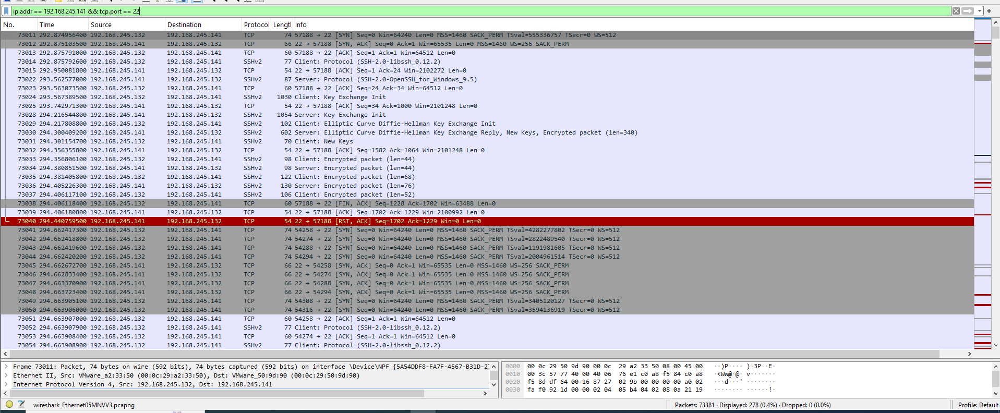
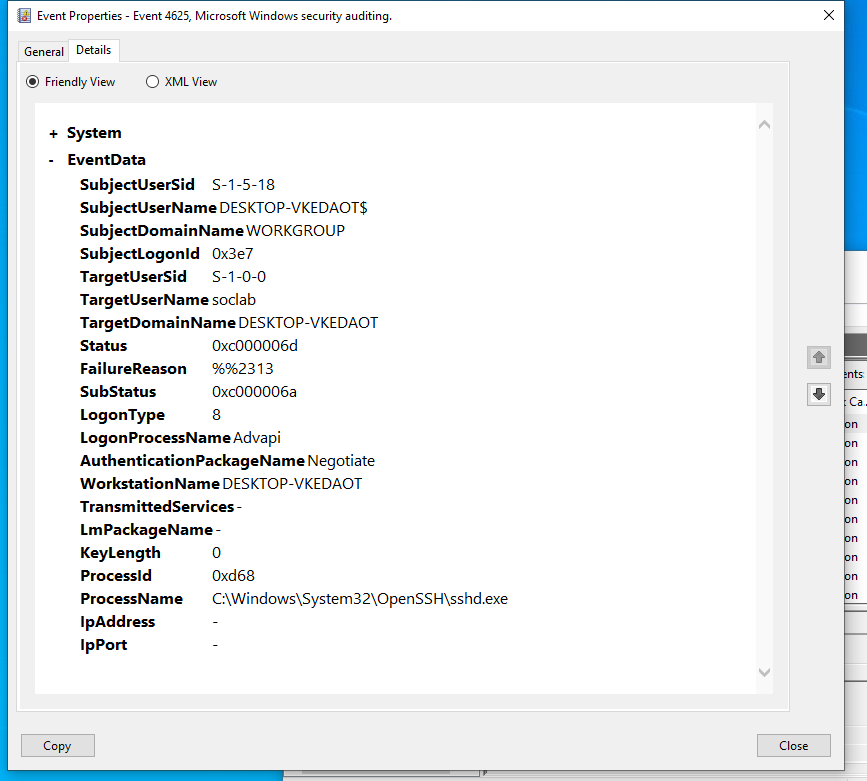

# SSH Brute Force Detection

## Objective

Detect repeated SSH connection attempts from a single source using Wireshark.

## Lab Setup

- Attacker: Kali Linux
- Attacker IP: 192.168.245.132
- Target: Windows 10
- Target IP: 192.168.245.141
- Target SSH Port: 22
- Tool used for simulation: Hydra
- Tool used for packet analysis: Wireshark

## Attack Performed

A controlled SSH authentication test was performed against the Windows 10 lab machine using Hydra with a small test wordlist containing intentionally incorrect passwords.

Command:

hydra -l soclab -P /tmp/ssh-test.txt ssh://192.168.245.141

## Wireshark Observation

Wireshark captured repeated TCP connections from:

192.168.245.132 → 192.168.245.141

The connections repeatedly targeted TCP port 22.

Multiple new TCP SYN connections were observed from the same source IP, followed by SSHv2 traffic.

## Detection

Repeated SSH connections from the same source IP to TCP port 22 can indicate possible brute-force or password-guessing activity.

Wireshark can show the repeated network connections, but because SSH authentication is encrypted, the actual incorrect passwords are not visible in the packet contents.

## Wireshark Filter

ip.addr == 192.168.245.141 && tcp.port == 22

## SOC Investigation Note

In a real SOC environment, the network evidence should be correlated with authentication logs from the target system.

Useful indicators include:

- Source IP
- Number of SSH connection attempts
- Time between attempts
- Authentication failures
- Target username
- Successful login after multiple failures

## Conclusion

The capture demonstrates repeated SSH connection attempts from a single source against the Windows 10 SSH service. The activity is consistent with a controlled SSH brute-force simulation.

## Evidence

### SSH Brute Force Connections

## Windows Authentication Log Correlation

Windows Security Event Viewer recorded multiple failed logon events during the SSH test.

- Event ID: 4625
- Target Account: soclab
- Process: OpenSSH sshd.exe
- Logon Type: 8
- Status: 0xc000006d

Event ID 4625 indicates that an account failed to log on.

The Windows event confirms failed authentication activity through the OpenSSH service, while the Wireshark capture shows repeated SSH connections from the Kali machine to TCP port 22.

Together, the network and host evidence provide a basic SOC-style correlation between repeated SSH connection attempts and failed authentication events.

## Additional Evidence

### Windows Failed SSH Authentication

